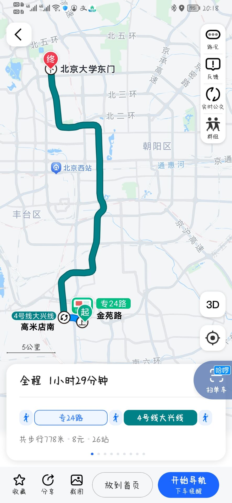
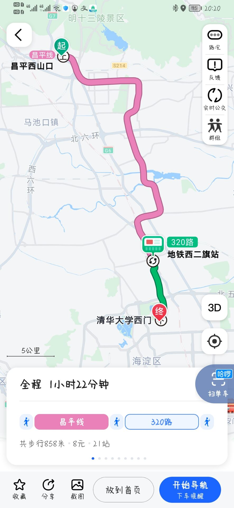
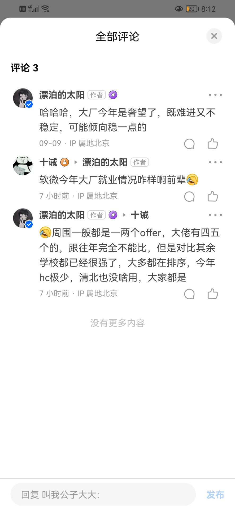

# DXU-win
大兴赢!!!

1. 中秋节大兴教务还在上班，发预推免通知，敬业精神赢麻了！
2. 美团offer清北t0独一档，其余学校一档
3. 大兴大学地方偏，但是外卖便宜，物价偏低，小赢
4. 大兴推免9月建群，超强凝聚力，赢！
5. 大兴对面就有kfc，必胜客，超级加倍赢
6. 比昌平交通方便，大兴回去是北京大学东门，昌平回去是清华大学西门(赢)，参看[附录交通图](#交通图对比)
7. dxu博士一直在燕园，cs和信科还在昌平，大赢！想在燕园敲代码？你需要dxu！！！
8. 某电填去向大兴人填写北京大学软件与微电子学院（骄傲），清深人填写清华大学，突出软微含金量（引群友语录：软微人沐浴在圣软微的光辉之下，却从不以此为敬）（此条只是个例，图一乐，无其他意思）
9. 9月15日群友们讨论学校保研情况，完后开始认亲（重点就突出个团结！！赢麻）
10. 某群友与一国企hr讨论，被说到学历是同龄人里面最优秀的那一批，去国企非常吃香（国企比较重学历，互联网大厂更多看重个人能力，二者皆得那就是乱杀）
11. 清北选调独一档，如果无心互联网可以考虑定向选调，相对其他高校出路较多
12. 软微从2022年夏令营招生开始偏科研向，但是导师基本上都是在信科实验室的，从群友那了解到基本上都是可以有信科博士生带的（软件和芯片都有），如果冲不上信科的话可以考虑软微直博也差不多
13. 网上黑rw的比较多，但是看看时间基本上都是16年之前了，最近几年招生质量上来之后，通过前面几届学长的努力，rw风评还是比较可以的，同时正统北大文凭，去哪都挺吃香的，所以建议抱着理性态度看互联网上的信息
14. 在网上很少能找到rw导师的信息（官网上教师信息上次更新还是在2018年），我们今年（2022年）基本都是在宣讲的时候才了解到导师信息，看到具体方向之后自己有兴趣直接去找导师联系陶瓷了，不过信息都比较少（据说是因为接的国家项目较多，为了防止来自漂亮国的安全问题，所以写的都比较少或者干脆没有，不过有些纵向导的信息还是可以从信科那边看到）
15. 2022年互联网大寒冬，就业成问题，周围人感觉基本都是0offer，大厂基本简历过了都很难，开始目标转向中小厂，知乎上dxu学长评论基本人家1-2offer，就业应该还是没问题的，毕竟titile在那里，自己稍微准备一下也还是不用愁没工作的（大厂不行中小厂，中小厂不行国企，实在不行就去卷选调，总是有出路的），参考[知乎评论](#知乎评论)

# 附录
## 交通图对比

**大兴->燕园**

  

**昌平->燕园**

  

## 知乎评论

  

